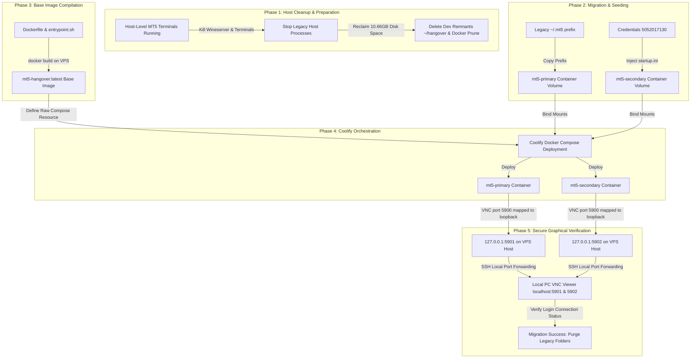

# Comprehensive Walkthrough & Transition Plan: Host-level MT5 to Coolify Docker Containers

This document details the transition from running two legacy, host-level MetaTrader 5 (MT5) terminals directly on the host VPS, to running them as isolated, production-grade Docker containers orchestrated via Coolify.

---

## 1. High-Level Transition Roadmap



---

## 2. Walkthrough Steps

### Phase 1: Oracle VPS Cleaning
Before starting, we clean up the host VPS to ensure sufficient resources. We remove old compilation folders (`~/hangover`, `~/hangover-pkg`, `~/mt5`, and the accidental `~/~` directory) and prune the Docker cache.
- **Outcome**: Reclaimed **10.66 GB** of disk space.

### Phase 2: Prefix Migration & Seeding
To transition without requiring re-authentication or passwords:
1. **Primary Account**: We copy the entire directory contents from the old host prefix `/home/ubuntu/.mt5` to the new container-persistent directory `/home/ubuntu/mt5_instances/mt5_first_account/wine_prefix`. This carries over the active, encrypted login session tokens.
2. **Secondary Account**: We create a `startup.ini` config file containing:
   ```ini
   [Common]
   Login=5052017130
   Password=GjOnAg@7
   Server=MetaQuotes-Demo
   ```
   and inject it into `/home/ubuntu/mt5_instances/mt5_second_account/config/startup.ini`.

### Phase 3: Building the VNC-Capable Generic Image
We upload the new `Dockerfile`, `entrypoint.sh` (incorporating `x11vnc` and runtime auto-installation), and `config-validator.sh` to `~/mt5_instances/build` on the VPS.
We compile it natively:
```bash
sudo docker build -t mt5-hangover:latest ~/mt5_instances/build
```
Because the emulation-heavy Windows installation tasks are moved to the container's runtime (first-boot check), this build step finishes in under 2 minutes.

### Phase 4: Coolify Docker Compose Setup
We define the deployment as a single **Docker Compose** application in Coolify. This manages both container instances together, defining their loopback port maps and volumes:
```yaml
version: '3.8'
services:
  mt5-primary:
    image: mt5-hangover:latest
    container_name: mt5-primary
    pid: host
    ports:
      - "127.0.0.1:5901:5900"
    volumes:
      - /home/ubuntu/mt5_instances/mt5_first_account/wine_prefix:/root/.wine
      - /home/ubuntu/mt5_instances/mt5_first_account/config:/etc/mt5/config
    environment:
      - DISPLAY=:99
    restart: always

  mt5-secondary:
    image: mt5-hangover:latest
    container_name: mt5-secondary
    pid: host
    ports:
      - "127.0.0.1:5902:5900"
    volumes:
      - /home/ubuntu/mt5_instances/mt5_second_account/wine_prefix:/root/.wine
      - /home/ubuntu/mt5_instances/mt5_second_account/config:/etc/mt5/config
    environment:
      - DISPLAY=:99
    restart: always
```

#### Coolify Dashboard Steps:
1. Open Coolify in your browser at `http://147.224.213.171:8000`.
2. Navigate to **Projects** -> click **Add New Project** -> Name it `MT5-Production`.
3. Inside the environment, click **New Resource** -> select **Docker Compose**.
4. Paste the YAML compose code above.
5. Select **Raw Compose** and configure the variables.
6. Click **Deploy**.

---

## 3. Secure Graphical Verification Walkthrough

Once the Compose stack is deployed in Coolify, the two containers will start. The `x11vnc` graphical server will be running on port `5900` inside each container, mapped to `127.0.0.1:5901` and `127.0.0.1:5902` on the VPS host loopback.

To verify they are running and successfully logged in:

### Step 1: Establish Secure SSH Tunnels
Open a command prompt or PowerShell window on your local computer and run:
```bash
ssh -i "C:\Users\dixit\Desktop\mt5 antigravity\ssh-key-2026-06-19 (1).key" -L 5901:127.0.0.1:5901 -L 5902:127.0.0.1:5902 ubuntu@147.224.213.171
```
*Note: Keep this terminal window open. This forwards your local PC's ports 5901 and 5902 securely over SSH to the VPS host.*

### Step 2: Open VNC Client & Connect
1. Open your VNC Viewer client (such as RealVNC, TigerVNC, or UltraVNC).
2. Connect to the primary instance:
   - Address: `localhost:5901`
   - Confirm that the MT5 user interface appears on the screen.
3. Connect to the secondary instance:
   - Address: `localhost:5902`
   - Confirm that the MT5 user interface appears on the screen.

### Step 3: Inspect Connection Status (Successful Login check)
In the VNC screen for each instance, inspect the bottom-right corner of the MT5 window:

```
┌──────────────────────────────────────┐
│ Connection Indicator (Bottom Right)  │
├──────────────────────────────────────┤
│ 🟢 Active: [ 1045 / 2 Kbps ]         │  <-- SUCCESS: Login active & trading data syncing.
│ 🔴 Disconnected: [ No connection ]   │  <-- FAILURE: Check credentials or Wine prefix paths.
└──────────────────────────────────────┘
```

- **Logged In**: You will see green/blue connection bars and numbers showing network traffic speed (e.g. `2341/3 Kbps`).
- **Demo Account details**: You will see the connection icon active, showing that the system successfully logged in using your credentials.

---

## 4. Post-Migration Purge
Once you have visually verified both terminals are active and logged in through VNC, you can safely delete the legacy host Wine prefix folders to keep the VPS clean:
```bash
ssh -i "C:\Users\dixit\Desktop\mt5 antigravity\ssh-key-2026-06-19 (1).key" ubuntu@147.224.213.171 "rm -rf ~/.mt5 ~/.mt5_second_account"
```
Your MT5 production terminal stack is now 100% containerized, secure, and managed under Coolify!
