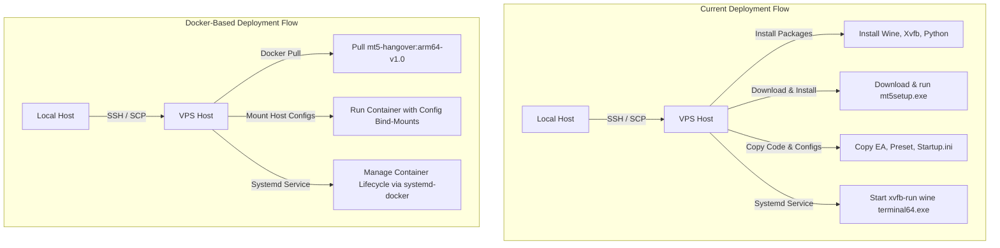

# Design Spec: Dockerize mcp-mt5 for ARM64 Hangover + X11 Deployment

This specification outlines the strategy, architecture, and implementation details for containerizing MetaTrader 5 (MT5) for production deployment. The target architecture is ARM64 Linux (e.g. AWS Graviton, Oracle Ampere VPS) running MT5 inside the Hangover emulator (optimized Wine fork) with headless rendering using Xvfb. 

> [!NOTE]
> The Docker image is strictly for running the MT5 terminal and Expert Advisor in production. The `mcp-mt5` MCP server is NOT included in this image.

---

## 1. Architectural Strategy

We will use **Approach A (Portable Mode)** to run MT5 inside the Docker container.

### Current Flow vs. Docker Flow



### Key Design Decoupling
1. **Immutable Production Docker Image**: Contains the Ubuntu OS runtime, Xvfb dependencies, Hangover (Wine), MT5 binaries, and required Windows support libraries (WebView2). No Python or MCP server code is bundled.
2. **Runtime Configuration Bind Mounts**: Inject all instance-specific credentials (`startup.ini`), strategy tester parameters (`tester.ini`), compiled EAs (`.ex5`), and presets (`.set`) at startup.
3. **Persistent Wine Prefix Volume**: Mount a host folder (e.g. `~/.wine`) to `/root/.wine` in the container to maintain broker authorization tokens and trading account states across restarts.

---

## 2. Docker Image Layers (ARM64)

The Dockerfile is structured as a multi-stage build targeting `linux/arm64` on Ubuntu 24.04:

- **Stage 1 (Hangover Retrieval)**:
  - Download official stable release: `hangover_11.9_ubuntu2404_noble_arm64.tar` from `https://github.com/AndreRH/hangover/releases`.
  - Extract the archive to a staging folder.
- **Stage 2 (Base OS & X11 Dependencies)**:
  - Base image: `ubuntu:24.04` (ARM64).
  - Install system dependencies: `xvfb`, `x11-apps`, `xauth`, `ca-certificates`, `curl`, `libasound2`, `libpulse0`.
- **Stage 3 (Hangover/Wine Installation)**:
  - Copy Hangover binaries from Stage 1 into system paths (`/opt/hangover` and symlinks to `/usr/local/bin`).
  - Configure `WINEPREFIX=/root/.wine` and initialize Wine with Windows 11 compatibility mode (`winecfg -v=win11`).
- **Stage 4 (MT5 & WebView2 Installation)**:
  - Download `mt5setup.exe` and `webview2.exe` (silent installers).
  - Run them inside Wine headless via Xvfb:
    - `wine webview2.exe /silent /install`
    - `wine mt5setup.exe /auto`
  - Clean up installer files.
- **Final Stage (Runtime Configuration)**:
  - Set default environment variables (`DISPLAY=:99`, `WINEPREFIX=/root/.wine`).
  - Copy `config-validator.sh` and `entrypoint.sh` to the container and set `ENTRYPOINT ["/entrypoint.sh"]`.

---

## 3. Volume Mount and Directory Strategy

Each running container instance represents a single MT5 trading/backtesting setup. The volume mapping on the host is defined as follows:

| Host Directory | Container Mount Path | Mode | Purpose |
|----------------|----------------------|------|---------|
| `/home/ubuntu/<instance>/wine_prefix` | `/root/.wine` | rw | Persist Wine prefix state, broker sessions, login tokens |
| `/home/ubuntu/<instance>/config` | `/etc/mt5/config` | ro | Input files (`startup.ini`, `tester.ini`, `.ex5`, `.set`) |
| `/home/ubuntu/<instance>/logs` | `/root/.wine/drive_c/Program Files/MetaTrader 5/logs` | rw | MT5 application logs |
| `/home/ubuntu/<instance>/mql5_logs` | `/root/.wine/drive_c/Program Files/MetaTrader 5/MQL5/Logs` | rw | MQL5 Expert Advisor execution logs |
| `/tmp/.X11-unix` | `/tmp/.X11-unix` | rw | Optional: X11 socket sharing for graphical debug |

---

## 4. Entrypoint and Scripts Design

### `entrypoint.sh`
This script handles container initialization:
1. **Xvfb Initialization**: Start Xvfb on display port `DISPLAY` (default `:99`) in the background.
2. **Configuration Validation**: Run `config-validator.sh` on `/etc/mt5/config` to check required keys in `startup.ini` and `tester.ini` before booting MT5.
3. **Environment Prep**:
   - Ensure the Wine prefix is initialized.
   - Copy or symlink mounted EA binaries (`.ex5`) and presets (`.set`) from `/etc/mt5/config/` to `/root/.wine/drive_c/Program Files/MetaTrader 5/MQL5/Experts/` and `/root/.wine/drive_c/Program Files/MetaTrader 5/MQL5/Presets/`.
   - Copy `startup.ini` to `/root/.wine/drive_c/startup.ini`.
4. **Execution**:
   - Launch MT5 terminal with `/portable` flag and config pointer: `wine "C:/Program Files/MetaTrader 5/terminal64.exe" /portable /config:C:\startup.ini`
5. **Graceful Shutdown**: Capture `SIGTERM` / `SIGINT` signals, terminate MT5 gracefully, stop Xvfb, and exit.

### `config-validator.sh`
A lightweight bash script that parses:
- `startup.ini`: Validates presence of `Login`, `Password`, `Server` parameters.
- `tester.ini` (if present): Validates basic keys.
- Returns non-zero exit code if validation fails, preventing the container from running with bad configs.

---

## 5. Host Integration and Orchestration

### Systemd Service Template (`mt5-instance@.service`)
An instance-aware systemd service template that manages individual Docker containers:

```ini
[Unit]
Description=Docker MetaTrader 5 Instance - %i
After=docker.service
Requires=docker.service

[Service]
TimeoutStartSec=0
Restart=always
ExecStartPre=-/usr/bin/docker kill mt5-%i
ExecStartPre=-/usr/bin/docker rm mt5-%i
ExecStart=/usr/bin/docker run --name mt5-%i \
  --pid=host \
  -v /home/ubuntu/mt5_instances/%i/wine_prefix:/root/.wine \
  -v /home/ubuntu/mt5_instances/%i/config:/etc/mt5/config \
  -v /home/ubuntu/mt5_instances/%i/logs:/root/.wine/drive_c/Program\ Files/MetaTrader\ 5/logs \
  -v /home/ubuntu/mt5_instances/%i/mql5_logs:/root/.wine/drive_c/Program\ Files/MetaTrader\ 5/MQL5/Logs \
  -e DISPLAY=:99 \
  ghcr.io/dixit6054/mt5-hangover:arm64-v1.0
ExecStop=/usr/bin/docker stop mt5-%i

[Install]
WantedBy=multi-user.target
```

### `remote_deploy.py` Updates
We will refactor `deploy_remote_instance` to:
1. SSH into the remote VPS.
2. Ensure directory structures are set up on the host (e.g. `/home/ubuntu/mt5_instances/<instance_name>/config`).
3. SCP `startup.ini`, `tester.ini`, EAs (`.ex5`), and presets (`.set`) directly to the host directory.
4. Run `docker pull ghcr.io/dixit6054/mt5-hangover:arm64-v1.0`.
5. Deploy the `mt5-instance@.service` template to `/etc/systemd/system/`.
6. Enable and start `mt5-instance@<instance_name>.service`.

---

## 6. Observability & Monitoring Compatibility

### `mt5_monitor.sh` Integration
Because the container runs with `--pid=host`, host-level monitoring via `mt5_monitor.sh` will still locate the `terminal64.exe` process ID. 
However, inside the container, the path maps to `/root/.wine/drive_c/...`. 
To ensure zero modification to the host monitor script, we mount the log directories exactly to where the host monitor expects them (e.g. `/home/ubuntu/.mt5_second_account/drive_c/Program Files/MetaTrader 5/...`).

### `health_check.sh` Integration
System metrics (CPU, RAM, Disk) remain unchanged on the host level. We can append Docker container stats query (`docker stats --no-stream`) to health check logging.

---

## 7. Verification Plan

### Automated Tests
- Run a smoke test inside the Docker container to verify:
  1. `wine --version` returns Hangover/Wine version.
  2. `terminal64.exe` is successfully executed.

### Manual Verification
- Deploy a containerized demo instance on an Ampere VPS.
- Verify Telegram alerts trigger and report successful authorization of the demo account.
